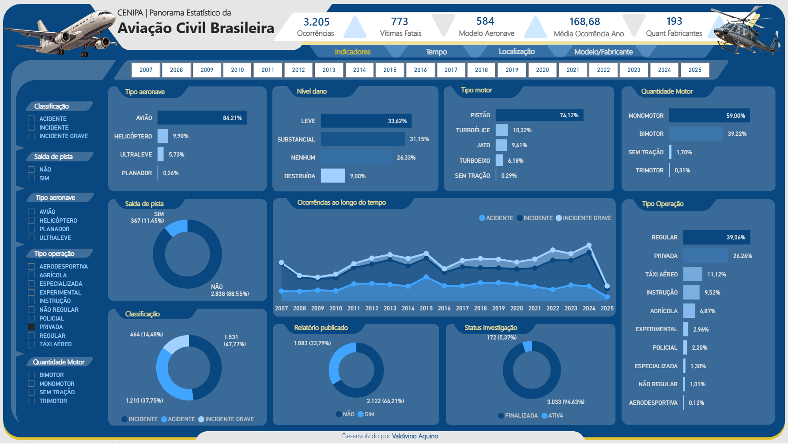

## 📊 Panorama Estatístico da Aviação Civil Brasileira

Este repositório apresenta um painel interativo desenvolvido para visualizar dados estatísticos da aviação civil brasileira com base nas ocorrências reportadas ao CENIPA (Centro de Investigação e Prevenção de Acidentes Aeronáuticos).

## ✈️ Sobre o Projeto

O dashboard oferece uma análise abrangente sobre os incidentes, acidentes e incidentes graves registrados na aviação civil do Brasil entre os anos de 2007 e 2025.

## 📊 Visualizações Incluídas

- **Tipo de Aeronave** (avião, helicóptero, ultraleve, planador)
- **Nível de Dano** (leve, substancial, nenhum, destruída)
- **Tipo e Quantidade de Motor**
- **Tipo de Operação** (regular, privada, táxi aéreo, agrícola, etc.)
- **Classificação da Ocorrência** (acidente, incidente, incidente grave)
- **Ocorrências ao Longo do Tempo**
- **Status de Investigação e Publicação de Relatórios**
- **Saída de Pista**

## 📆 Período Analisado

De 2007 a 2025, com destaque para a evolução temporal das ocorrências.

## 💡 Tecnologias Utilizadas

- **Power BI Desktop**
- **Fonte de Dados**: Relatórios públicos do CENIPA
- **Design**: Interface personalizada com temas visuais modernos

## 🧑‍💻 Desenvolvedor

**Valdivino Aquino**  
Especialista em Business Intelligence

## 🖼️ Captura de Tela

## 📄 Licença

Este projeto é de uso educacional e informativo. A redistribuição dos dados deve respeitar as normas do CENIPA.

---
